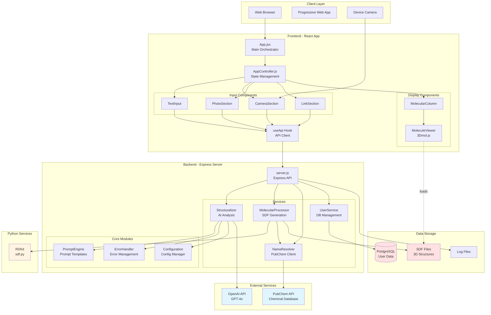
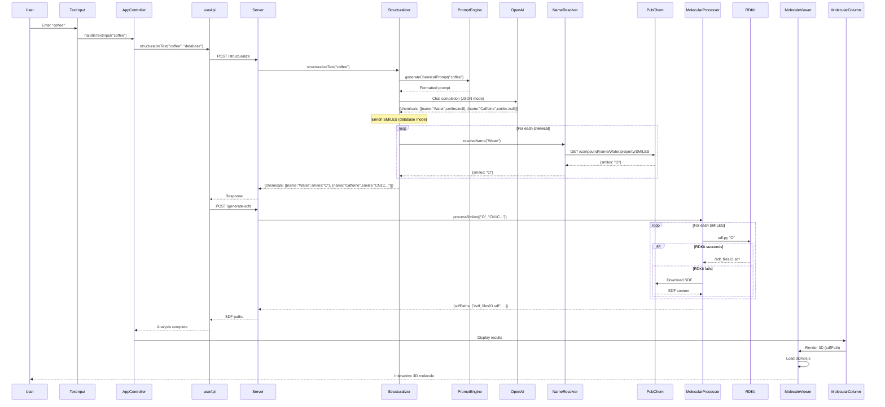
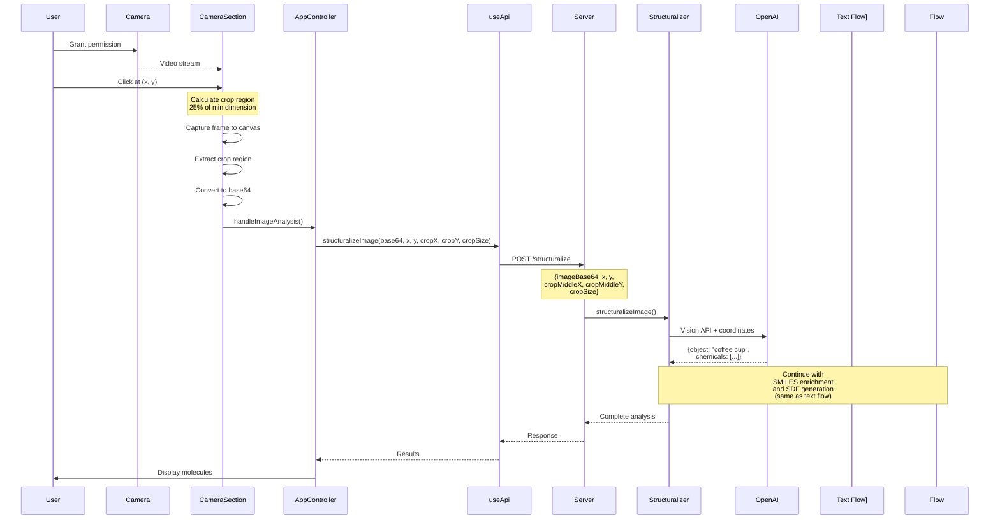
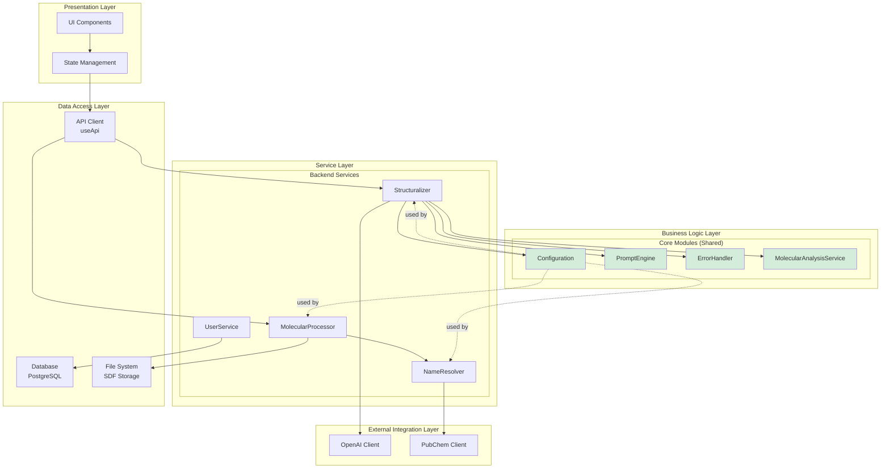
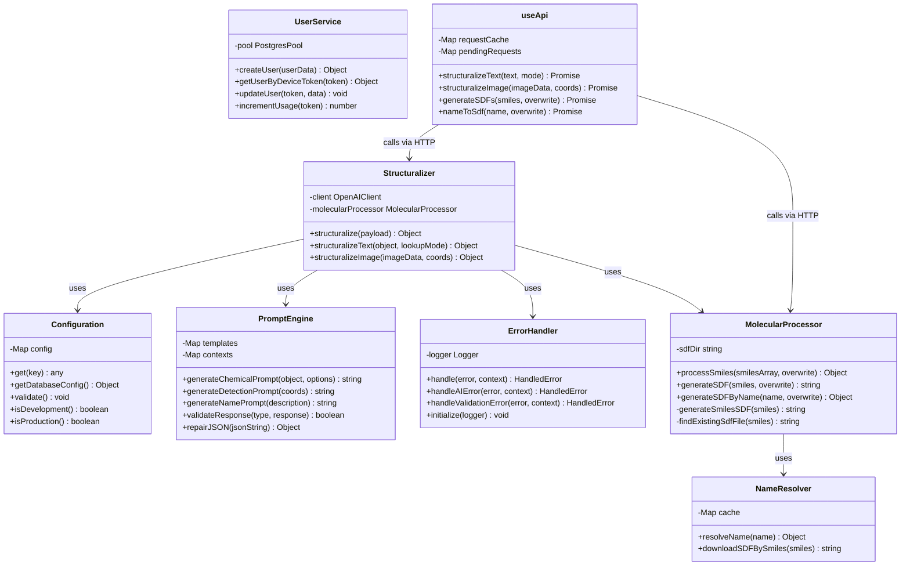
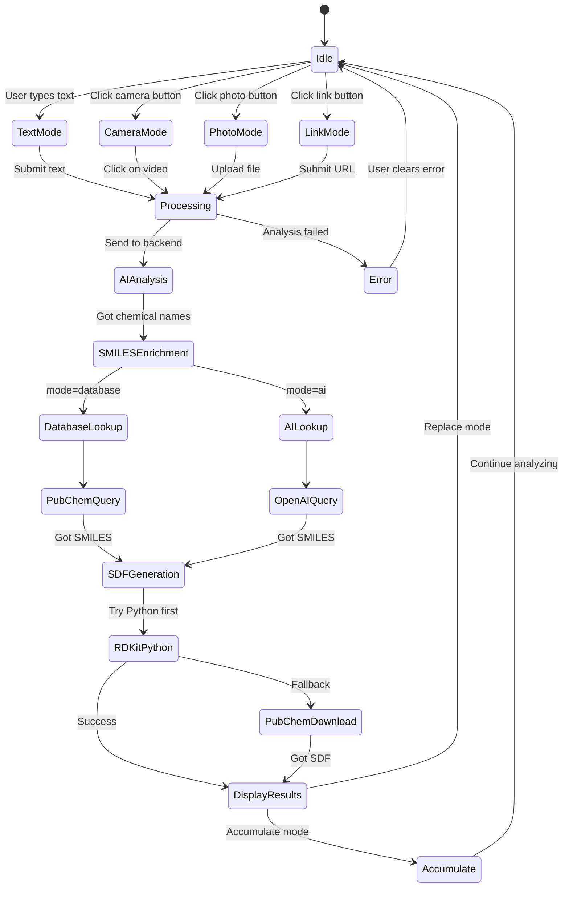
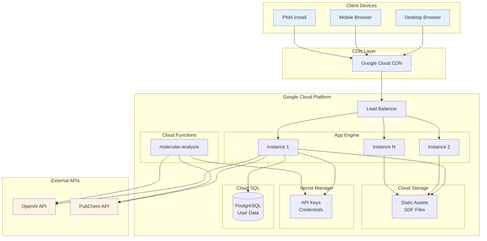
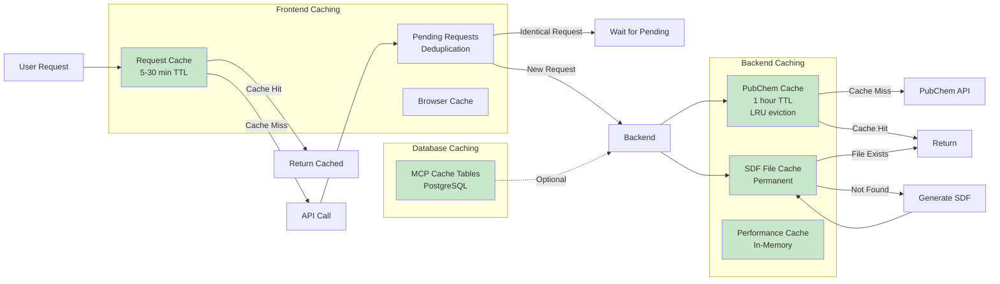
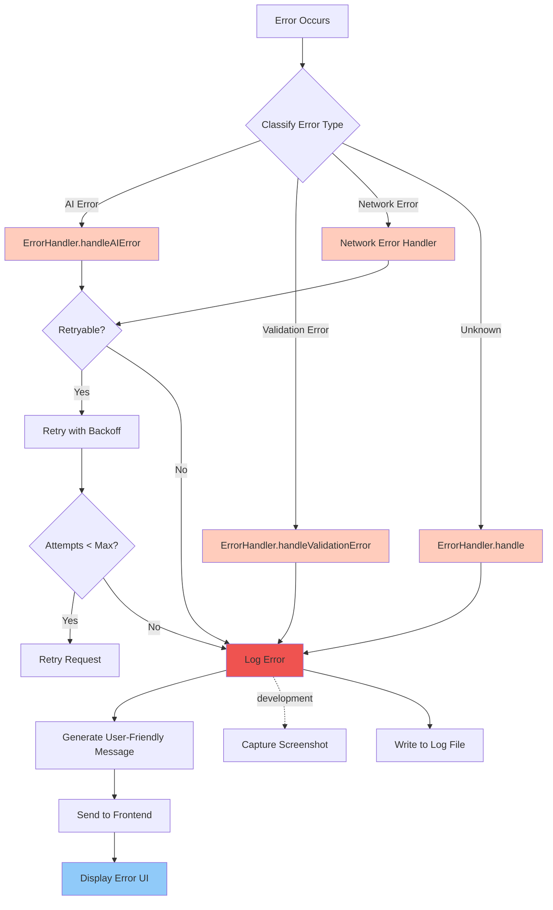
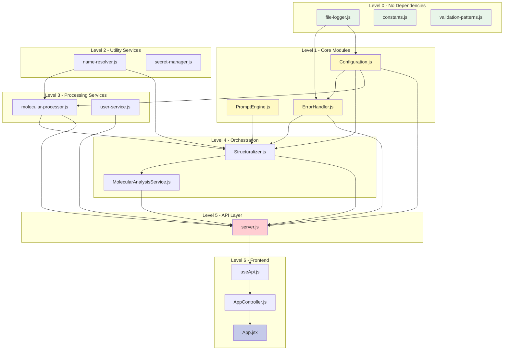

# Architecture Diagrams - Molecular Space Analyzer

## 1. System Architecture Overview

## 2. Data Flow - Text Analysis

## 3. Data Flow - Camera Analysis

## 4. Component Architecture

## 5. Class Diagram - Core Services

## 6. State Machine - Input Mode Flow

## 7. Deployment Architecture

## 8. Caching Architecture

## 9. Error Handling Flow

## 10. Module Dependency Graph

## How to View These Diagrams

These diagrams use **Mermaid** syntax and can be viewed in:

1. **GitHub/GitLab**: Renders automatically in `.md` files
2. **VS Code**: Install "Markdown Preview Mermaid Support" extension
3. **Cursor**: Should render in preview mode
4. **Online**: https://mermaid.live/
5. **Documentation sites**: Supports Mermaid (GitBook, Docusaurus, etc.)

## Diagram Export

Use `@mermaid-js/mermaid-cli` to export diagrams as PNG/SVG.

